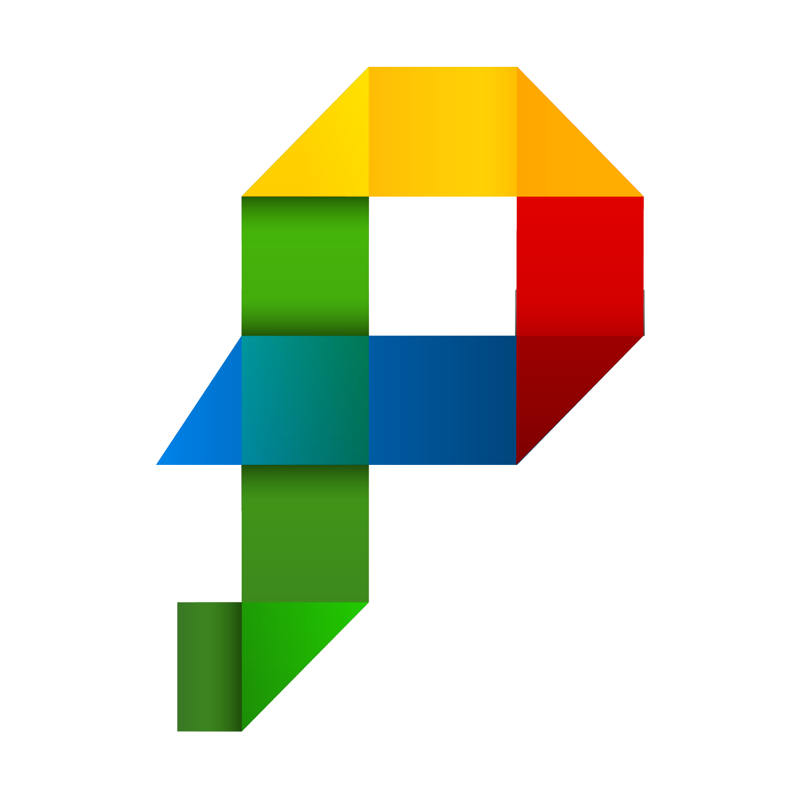

# PPX



PPX 是一个用 Python、pywebview、PyInstaller 和 Web 前端构建 Windows、macOS、Linux 桌面应用的开源框架。

[](https://github.com/pangao1990/PPX/actions/workflows/main.yml)
[](LICENSE)
[](https://www.python.org/)
[](https://nodejs.org/)

> **当前状态：** `main` 正在准备 PPX V6.0.0。V6 是全新架构，不兼容 V5，也不提供 V5 原地迁移。V5.3.4 源码保存在 [`V5.3.4` 标签](https://github.com/pangao1990/PPX/tree/V5.3.4)，旧项目请继续固定使用 V5。

**快速入口：** [完整文档](https://blog.pangao.vip/docs-ppx/v6/guide/introduction) · [十分钟快速上手](https://blog.pangao.vip/docs-ppx/v6/guide/quick-start) · [V5 文档](https://blog.pangao.vip/docs-ppx/v5/) · [变更记录](CHANGELOG.md) · [问题反馈](https://github.com/pangao1990/PPX/issues)

## 前言

[**PPX**](https://blog.pangao.vip/docs-ppx/)（曾用名 vue-pywebview-pyinstaller）。第一个 **P** 表示 **P**ython，当然，也可以表示 **P**angao（潘高，也就是我本人）。第二个 **P** 表示 **P**ywebview，也可以表示 **P**yInstaller。第三个 **X** 表示无限可能，指视图层可以使用 Vue、React、Angular、HTML 中的任意一种。

## 搭后语

现如今，要说比较火的编程语言当属 JavaScript 和 Python 了，这两门语言都可以独立编写前端页面、后端服务器、手机 APP、电脑客户端等等，无所不能。不过，不同的编程语言有不同的侧重点。比如 JavaScript 写网页得心应手，Python 处理大数据信手拈来。那么，能不能取两者的优点，构建一个跨平台客户端框架呢？这就有了今天的主角：[PPX](https://blog.pangao.vip/docs-ppx/)。

## 应用简介

[PPX](https://blog.pangao.vip/docs-ppx/) 基于 pywebview 和 PyInstaller 框架，构建 macOS、Windows 和 Linux 平台的客户端。本应用的视图层支持 Vue、React、Angular、HTML 中的任意一种，业务层支持 Python 脚本。考虑到某些生物计算场景数据量大、数据私密，因此将数据上传到服务器计算并不一定是最优解，采用本地 Python 也是一种不错的选择。不过，如果需要调用远程 API，本应用也是支持的。

### 应用优势

- 视图层可使用任意一款你喜欢的前端框架，比如 Vue、React、Angular、HTML 等，迁移无压力
- 采用 Python 编程语言开发业务层，模块丰富
- 本应用已经封装打包环节，一键生成 macOS、Windows 和 Linux 平台的客户端应用。开发者只需要关注视图效果和业务逻辑本身，将繁重复杂的打包环节交给本应用处理即可
- PPX 将框架与用户业务代码分离，兼容更新不会覆盖 `api/`、`gui/src/`、`ppx/assets/` 或用户数据
- 提供多前端脚手架、单源图标生成，以及 `ppx init/doctor/update/dev/build`，降低创建、环境检查、框架更新和打包成本

### 适用场景

- 对软件的用户界面有一定美感要求
- 需要用到 Python 中的人工智能、生信分析等模块
- 考虑搭建本地应用，使用本机计算和存储资源

### 适用人群

熟悉 Python 3 和任意一款前端框架，如 Vue、React、Angular、HTML 编程的程序员。

## 目录

- [核心设计](#核心设计)
- [项目结构](#项目结构)
- [环境要求](#环境要求)
- [五分钟创建第一个应用](#五分钟创建第一个应用)
- [示例工作台](#示例工作台)
- [编写 Python 业务 API](#编写-python-业务-api)
- [从 JavaScript 调用 Python](#从-javascript-调用-python)
- [资源与用户数据](#资源与用户数据)
- [内置桌面能力](#内置桌面能力)
- [配置文件](#配置文件)
- [命令行参考](#命令行参考)
- [一键更新 PPX 框架](#一键更新-ppx-框架)
- [三端打包](#三端打包)
- [GitHub Actions 在线打包](#github-actions-在线打包)
- [成品应用更新](#成品应用更新)
- [测试与质量保证](#测试与质量保证)
- [常见问题](#常见问题)
- [V5 项目](#v5-项目)
- [文档与参与开发](#文档与参与开发)

<span id="v6-的核心设计"></span>

## 核心设计

PPX 的目标只有一句话：**开发者只关心 Python 业务和 Web 界面，不关心窗口协调、RPC、打包与框架升级。**

框架只发布两个包：

| 包 | 注册表 | 负责什么 | 不负责什么 |
| --- | --- | --- | --- |
| `ppx-py` | PyPI | Python 运行时、RPC 服务端、窗口、存储、CLI、更新器、PyInstaller 与三端安装器 | 用户业务逻辑、前端组件 |
| `ppx-js` | npm | 等待 pywebview、RPC 调用、事件、超时、错误和 TypeScript 类型 | Vue、React、Element Plus 等 UI 框架 |

Vue、React、Angular、原生 HTML 或任意组件库都属于用户的 `gui/`。PPX 不绑定具体视图框架，也不会把 Element Plus 或 Vue 塞进 `ppx-py`、`ppx-js`。

一次调用的链路如下：

```text
Web 页面
  └─ ppx-js：生成 requestId、等待 Bridge、管理总超时
       └─ pywebview 注入的唯一入口 Bridge.call()
            └─ ppx-py：白名单查找 @api_method
                 └─ api/：执行同步或异步 Python 业务
```

业务函数只有显式添加 `@api_method("命名空间.方法")` 后才会暴露。Python 返回值经过严格 JSON 校验，异常会被转换成稳定错误码，不会把内部堆栈直接暴露给页面。

## 项目结构

`ppx new my-app` 生成的普通项目只有三个主要目录：

```text
my-app/
├── api/
│   ├── __init__.py
│   ├── api.py                 # Python 业务 API
│   ├── requirements.txt       # 业务额外依赖
│   └── resources/             # 模型、模板等只读业务资源
├── gui/
│   ├── src/                   # Web 前端业务源码
│   ├── index.html
│   └── package.json
├── ppx/
│   └── assets/
│       ├── logo.png           # Linux 图标
│       ├── logo.ico           # Windows 图标
│       ├── logo.icns          # macOS 图标
│       └── dmg-background.png # macOS 安装镜像背景
├── package.json               # 常用命令快捷入口
├── pnpm-workspace.yaml
├── ppx.toml                   # 开发者配置
└── ppx.lock                   # 框架精确版本锁，由 ppx update 管理
```

| 路径 | 所有者 | 是否允许框架更新修改 |
| --- | --- | --- |
| `api/` | 应用开发者 | 否 |
| `gui/src/` | 应用开发者 | 否 |
| `ppx/assets/` | 应用开发者 | 否 |
| 应用数据目录 | 最终用户 | 否 |
| `ppx.toml` 的应用配置 | 应用开发者 | 只更新框架版本字段 |
| `ppx.lock` | PPX | 是 |
| 两个包的依赖记录 | PPX | 是 |

本仓库本身是框架源码，因此仓库中的 `ppx/` 还包含：

```text
ppx/
├── assets/                    # 示例应用可修改资源
├── packages/
│   ├── ppx-py/                # Python 包源码
│   └── ppx-js/                # JavaScript 包源码
└── tooling/
    ├── tests/                 # 自动化测试
    ├── scripts/               # 发布与安装包检查
    └── docs/                  # 框架维护文档
```

这些维护目录不会被复制进普通开发者项目。运行入口、PyInstaller spec、Inno Setup、DMG 和 deb 元数据会在构建时生成到 `build/cache/`，不需要用户维护。

## 环境要求

| 工具 | 最低要求 | 用途 |
| --- | --- | --- |
| Python | 3.9+ | Python 业务、pywebview、PyInstaller、PPX CLI |
| Node.js | 22.13+ | Web 前端工具链 |
| pnpm | 11.x | 前端依赖与工作区管理 |

平台附加要求：

- **Windows：** 正式安装包需要 [Inno Setup 6](https://jrsoftware.org/isinfo.php)；目标机器需要可用的 WebView2 Runtime。
- **macOS：** `ppx-py` 会按平台安装 `dmgbuild`，系统还需要自带的 `hdiutil`。公开分发必须自行完成 Developer ID 签名和公证。
- **Linux：** 需要 GTK3、WebKitGTK、PyGObject；生成 `.deb` 需要 `dpkg-deb`。请尽量在与目标用户相同或更旧的发行版基线上构建。

每个应用建议使用独立 Python 虚拟环境。不要把 PPX 安装进系统 Python 后让多个项目共享一套可变依赖。

## 五分钟创建第一个应用

### 1. 创建虚拟环境

```bash
python -m venv .venv
```

激活环境：

```bash
# macOS / Linux
source .venv/bin/activate

# Windows PowerShell
.venv\Scripts\Activate.ps1
```

### 2. 安装框架并创建项目

6.0.0 正式发布到 PyPI/npm 后使用：

```bash
python -m pip install ppx-py==6.0.0
ppx new my-app --frontend vue
cd my-app
ppx init
```

`--frontend` 支持：

- `vanilla`：原生 HTML、CSS、JavaScript，依赖最少，也是默认值；
- `vue`：Vue 3 + Vite；
- `react`：React + Vite。

`ppx init` 只做三件事：安装 `api/requirements.txt` 中的业务依赖、安装前端依赖、运行 `ppx doctor`。它不会生成或覆盖业务源码。

### 3. 启动开发环境

```bash
ppx dev
```

PPX 会自动启动 Vite、等待端口可用、导入 Python 业务模块并打开桌面窗口。关闭窗口后，PPX 会回收自己启动的前端进程。

如果前端已经由 IDE 单独启动：

```bash
ppx dev --skip-frontend
```

### 4. 从源码运行本仓库

在两个包正式发布前，或参与框架开发时：

```bash
git clone https://github.com/pangao1990/PPX.git
cd PPX
python -m venv .venv
source .venv/bin/activate       # Windows 请使用对应激活命令
python -m pip install -e ppx/packages/ppx-py
pnpm install
ppx doctor
ppx dev
```

## 示例工作台

仓库自带一个可交互的工作台，通过 `pnpm start` 打开。`ppx new` 创建的是精简入门模板，方便你从小项目开始开发；它不会复制整个工作台。

| 页面 | 可以体验什么 |
| --- | --- |
| 工作台 | 输入姓名调用真实 Python、读取本机用户名、查看连接状态和最近五次调用 |
| 文件与目录 | 打开原生多文件或目录选择器，展示完整路径；取消后保留已有选择 |
| 本地存储 | 保存、恢复和清空本地便签，标注未保存状态，启动读取失败时可重试 |
| 开发文档 | 离线阅读环境准备、Python / JavaScript 调用和打包说明，访问项目资源 |
| 应用更新 | 按需检查版本、查看说明、下载进度、后台下载、取消、失败重试和打开已校验安装包 |

页面适配窄窗口，支持键盘焦点和明确的错误反馈。普通浏览器只预览布局，桌面操作保持禁用；需要通过 `ppx dev` 打开的窗口调用 Python。

“开始构建”和“开发文档”打开随应用附带的入门说明，断网也能使用。资源区的“在线开发文档”访问已上线的最新版介绍站，“V5 归档文档”单独访问旧版内容。外部链接交给系统浏览器打开，客户端保留当前页面。

前端入口是 `gui/src/App.vue`，主题样式在 `gui/src/assets/main.scss`，更新组件在 `gui/src/components/BtnUpdate.vue`，问候业务在 `api/api.py`。详见[示例工作台逐步讲解](https://blog.pangao.vip/docs-ppx/v6/guide/example-workbench)。

## 编写 Python 业务 API

默认业务入口是 `api/api.py`：

```python
from ppx_py import api_method


@api_method("user.greet")
def greet(name: str = "PPX") -> dict[str, str]:
    return {"message": f"你好，{name}！"}
```

异步函数不需要额外包装：

```python
import httpx
from ppx_py import api_method


@api_method("weather.query")
async def query_weather(city: str) -> dict:
    async with httpx.AsyncClient() as client:
        response = await client.get("https://example.com/weather", params={"city": city})
        response.raise_for_status()
        return response.json()
```

需要拆分多个模块时，在 `ppx.toml` 中声明：

```toml
[python]
modules = ["api.api", "api.report", "api.analysis"]
```

注意：

- API 名称必须包含命名空间，例如 `report.create`；
- 对象参数名必须与 Python 函数参数名一致，数组参数按位置传递；
- 返回值必须是标准 JSON 可序列化数据；
- `set`、`Path`、类实例、`NaN`、正负无穷大等值不能直接返回；
- 未添加 `@api_method` 的函数不会暴露给页面；
- 普通项目不需要编写 `main.py`，也不需要创建 `Application` 或 `Bridge`。

## 从 JavaScript 调用 Python

所有前端框架使用同一个接口：

```javascript
import { ppx, PpxError } from 'ppx-js'

async function greet() {
  try {
    const result = await ppx.call('user.greet', { name: '开发者' })
    console.log(result.message)
  } catch (error) {
    if (error instanceof PpxError) {
      console.error(error.code, error.requestId, error.message)
    }
  }
}
```

RPC 默认总超时为 30 秒，包括“等待 pywebview Bridge”和“等待 Python 结果”。第三个参数可以调整本次调用：

```javascript
const report = await ppx.call(
  'report.create',
  { id: 1 },
  { timeoutMs: 60_000 },
)
```

`timeoutMs: 0` 表示关闭超时，不建议用于无法取消的耗时任务。长任务更适合由 Python 后台执行，再通过事件报告进度：

```javascript
const unsubscribe = ppx.on('applicationUpdate.progress', (progress) => {
  console.log(progress.percentage, progress.sizeShow)
})

// 页面卸载或不再监听时
unsubscribe()
```

常见错误码：

| 错误码 | 含义 |
| --- | --- |
| `BRIDGE_UNAVAILABLE` | 当前页面不在 PPX/pywebview 内，或 Bridge 未就绪 |
| `BRIDGE_ERROR` | JavaScript 与 pywebview 之间的传输失败 |
| `TIMEOUT` | 整次 RPC 超过设置的总时间 |
| `METHOD_NOT_FOUND` | Python 没有注册该 API 名称 |
| `INVALID_PARAMS` | 参数或存储值不满足接口要求 |
| `INVALID_RESULT` | Python 返回值不是标准 JSON 数据 |
| `INTERNAL_ERROR` | Python 业务内部异常；详细信息只记录在 Python 日志中 |

每次调用都会生成 requestId，并传递到 Python 响应和 `PpxError`，方便关联前端日志与后端日志。

## 资源与用户数据

不要在业务代码里拼接当前工作目录、用户名或 PyInstaller 的临时目录。使用框架提供的稳定路径：

```python
from ppx_py import app_data_path, resource_path

# 开发时读取 api/resources/models/model.dat；打包后读取包内 resources/
model = resource_path("models/model.dat")

# 返回当前系统规范的可写应用数据目录
database = app_data_path("database.sqlite3")
```

默认用户数据位置：

| 系统 | 目录规则 |
| --- | --- |
| macOS | `~/Library/Application Support/<identifier>.<slug>/` |
| Windows | `%APPDATA%\<identifier>.<slug>\` |
| Linux | `$XDG_DATA_HOME/<identifier>.<slug>/`，未设置时使用 `~/.local/share/` |

两个辅助函数都会拒绝绝对路径、`..` 和符号链接越界。`resource_path()` 要求目标存在；`app_data_path()` 会创建应用数据根目录。

## 内置桌面能力

这些能力已经注册为 RPC，前端无需直接接触 pywebview：

| 方法 | 参数 | 返回值 |
| --- | --- | --- |
| `system.getAppInfo` | 无 | 名称、应用版本、框架版本 |
| `system.getOwner` | 无 | 当前操作系统用户名 |
| `system.openPath` | `{ path }` | 是否成功交给系统打开 |
| `system.openFileDialog` | `{ file_types?, directory?, multiple? }` | 文件信息数组；取消为空数组 |
| `system.saveFileDialog` | `{ filename?, file_types?, directory? }` | 保存路径；取消为空字符串 |
| `system.selectDirectory` | `{ directory? }` | 目录路径；取消为空字符串 |
| `window.getState` | 无 | `x/y/width/height/onTop` |
| `window.minimize` | 无 | `true` |
| `window.maximize` | 无 | `true` |
| `window.restore` | 无 | `true` |
| `window.toggleFullscreen` | 无 | `true` |
| `window.close` | 无 | `true` |
| `storage.get` | `{ key, default? }` | 已保存值或默认值 |
| `storage.set` | `{ key, value }` | `true` |
| `storage.delete` | `{ key }` | 删除前是否存在 |
| `applicationUpdate.check` | 无 | 更新检查结果 |
| `applicationUpdate.download` | 无 | 下载状态和校验后的路径 |
| `applicationUpdate.cancel` | 无 | `true` |

文件对话框示例：

```javascript
const files = await ppx.call('system.openFileDialog', {
  file_types: ['图片 (*.png;*.jpg)', '全部文件 (*.*)'],
  multiple: false,
})

const output = await ppx.call('system.saveFileDialog', {
  filename: 'report.pdf',
  file_types: ['PDF (*.pdf)'],
})
```

内置存储适合主题、最近目录、用户偏好和少量状态。键必须是字符串，值必须是标准 JSON 数据；大型数据、并发查询或复杂迁移请在业务层选择 SQLite 等数据库。

## 配置文件

`ppx.toml` 是开发者配置，`ppx.lock` 是 `ppx update` 维护的精确锁文件。不要手工修改 `ppx.lock`。

完整配置示例：

```toml
[project]
name = "My App"
slug = "my-app"
version = "1.0.0"
identifier = "com.example"
developer = "Your Name"
description = "My cross-platform desktop application"
website = "https://example.com"
windowsAppId = "F35003AB-441A-C0A6-4527-937E6A02F789"
format = 6

[python]
modules = ["api.api"]

[paths]
frontend = "gui"
resources = "api/resources"
assets = "ppx/assets"

[window]
widthRatio = 0.6667
heightRatio = 0.8
minWidthRatio = 0.5
minHeightRatio = 0.5
resizable = true
fullscreen = false
alwaysOnTop = false
confirmClose = false
backgroundColor = "#FFFFFF"

[development]
port = 5173

[storage]
filename = "storage.json"

[applicationUpdate]
enabled = false
releaseUrl = ""

[compatibility]
pythonApi = "6.0"
javascriptApi = "6.0"
dataSchema = "1"

[framework]
python = "6.0.0"
javascript = "6.0.0"
channel = "stable"
releaseUrl = "https://api.github.com/repos/pangao1990/PPX/releases/latest"
```

重要规则：

- `name` 必须是合法跨平台文件名；
- `slug` 只能使用小写字母、数字和中划线；
- `identifier` 至少两段，例如 `com.example`；
- `windowsAppId` 由 `ppx new` 自动生成，Windows 应用后续版本不要更改；
- `format` 在 V6 必须为整数 `6`；
- 窗口比例必须大于 0 且不大于 1；
- 布尔配置必须写 TOML 的 `true/false`，不能写成字符串；
- 三个 `[paths]` 值必须是项目内相对路径；
- `compatibility` 是框架更新判断依据，不要为了绕过冲突手工修改；
- `framework.python/javascript` 应由 `ppx update` 更新。

所有字段和校验规则见 [ppx.toml 完整参考](https://blog.pangao.vip/docs-ppx/v6/reference/config)。

## 命令行参考

| 命令 | 作用 | 是否修改业务源码 |
| --- | --- | --- |
| `ppx new NAME` | 创建 Vanilla 项目 | 创建新目录 |
| `ppx new NAME --frontend vue` | 创建 Vue 项目 | 创建新目录 |
| `ppx new NAME --frontend react` | 创建 React 项目 | 创建新目录 |
| `ppx init` | 安装业务与前端依赖，并执行 doctor | 否 |
| `ppx doctor` | 检查结构、版本、资源和平台工具 | 否 |
| `ppx doctor --json` | 输出适合 CI/IDE 的 JSON | 否 |
| `ppx icon SOURCE` | 从方形主图生成 PNG/ICO/ICNS | 只更新 `ppx/assets` 中三个图标 |
| `ppx dev` | 启动 Vite 和桌面窗口 | 否 |
| `ppx dev --skip-frontend` | 连接已经启动的前端服务 | 否 |
| `ppx build --console` | 生成当前平台调试应用 | 否 |
| `ppx build` | 生成并校验当前平台正式安装包 | 否 |
| `ppx update --check` | 只检查框架更新 | 否 |
| `ppx update --dry-run` | 显示更新计划 | 否 |
| `ppx update` | 执行兼容的框架更新 | 否 |
| `ppx update --to 6.x.y` | 指定目标 V6 版本 | 否 |

`ppx icon` 接受至少 512×512 的方形 PNG、JPEG 或 WebP。需要透明背景时使用 PNG 或 WebP。DMG 背景图不会被该命令覆盖。

## 一键更新 PPX 框架

框架更新和应用更新是两件事：

- `ppx update`：给应用开发者更新 `ppx-py`、`ppx-js`；
- `applicationUpdate.*`：给最终用户更新你打包好的成品应用。

推荐顺序：

```bash
ppx update --check
ppx update --dry-run
ppx update
ppx doctor
```

`ppx update` 从 GitHub Release 读取带 SHA-256 的 `ppx-update.json`，并比较四项契约：

```text
projectFormat + pythonApi + javascriptApi + dataSchema
```

处理规则：

- **完全兼容：** 安装清单指定的两个精确包版本，原子更新 `ppx.toml` 和 `ppx.lock`；
- **同版本漂移：** 恢复与锁文件一致的包版本；
- **不兼容：** 在安装或写文件前停止，并输出冲突字段；
- **V5、降级、错误通道、未知清单、缺少 SHA-256：** 直接拒绝；
- **执行失败：** 恢复受管配置、锁文件和原依赖版本。

更新前后都会计算 `api/`、`gui/src/`、`ppx/assets/` 的摘要。一旦这些目录发生意外变化，更新会失败并回滚。PPX 不会自动改写业务函数、页面或数据，也不会拿新模板覆盖旧项目。

为什么不能只运行 `pip install -U ppx-py`？因为两个包共同实现同一套 RPC 契约。单独更新任何一侧都可能让 Python 响应结构和 JavaScript 解包逻辑不一致。

## 三端打包

```bash
ppx build --console   # 调试应用，保留控制台，不制作安装器
ppx build             # 正式应用 + 当前平台安装包 + 自动校验
```

构建顺序：

1. 执行 `gui/package.json` 的 `build` script；
2. 在 `build/cache/` 生成内部 Python 入口和 PyInstaller spec；
3. 收集 GUI 产物、`ppx.toml`、业务资源和配置声明的 Python 模块；
4. 用 PyInstaller 构建当前平台应用；
5. 正式模式生成当前平台安装器并做基础完整性检查。

| 平台 | 应用/安装包 | 额外工具 | 默认图标 |
| --- | --- | --- | --- |
| Windows | 应用目录 + `应用名-V版本_Windows.exe` | Inno Setup 6 | `logo.ico` |
| macOS | `.app` + `应用名-V版本_macOS.dmg` | dmgbuild、hdiutil | `logo.icns` |
| Linux | 单文件应用 + `应用名-V版本_Linux.deb` | dpkg-deb | `logo.png` |

一个操作系统不能真实生成另外两个系统的安装包。跨平台发布必须让 Windows、macOS、Linux 分别执行 `ppx build`，然后在三套真实系统测试安装、首次启动、RPC、文件对话框、存储、业务资源、覆盖升级和卸载。

CI 成功不等于正式发布完成。macOS 还需要 Developer ID 签名和公证；Windows 应检查代码签名与 SmartScreen；Linux 应在目标发行版基线上验证 glibc、GTK 和 WebKitGTK 兼容性。

## GitHub Actions 在线打包

在线打包功能完整保留，由 [build 工作流](.github/workflows/main.yml) 实现，不要求你在本机准备三套系统。

1. 将已检查的代码提交并推送到自己的 GitHub 仓库；推送 `main` 或向 `main` 提交 PR 会自动运行。
2. 也可以进入仓库 **Actions → build → Run workflow**，选择分支，点击 **Run workflow** 手动打包。首次使用 fork 时，需先在 Actions 页面启用工作流；手动入口需要工作流已存在于默认分支。
3. 等待 Python 3.9 / 3.11 / 3.13 与 Node.js 22 / 24 的质量矩阵通过，再由 Windows、macOS、Ubuntu runner 分别打包。
4. 在成功运行记录底部的 **Artifacts** 下载 `Setup_Windows_架构`、`Setup_macOS_架构`、`Setup_Linux_架构`。每份包含安装包和 `SHA256SUMS`，保留 14 天。下载 Artifacts 通常需要登录 GitHub。
5. 解压后在对应系统安装、启动并完成[客户端验收](ppx/tooling/docs/desktop-qa.md)。需要长期公开下载时，再将已验收安装包上传至 GitHub Release。

Windows 任务准备 Inno Setup 6；Linux 任务准备 GTK/WebKitGTK、可供当前 Python 使用的 PyGObject 和 dpkg。构建任务安装 `api/requirements.txt` 中的业务依赖。缺少安装包时上传步骤直接失败，不会产生空的“成功”产物。

Linux runner 固定为 Ubuntu 24.04；产物的架构以 Artifact 名称为准，不代表通用包。更早发行版与其他 CPU 架构需要在相应环境另行构建和验收。工作流只构建并上传临时候选文件，不自动发布 npm/PyPI 或 GitHub Release。

## 成品应用更新

在 `ppx.toml` 配置你自己应用的 GitHub Release API：

```toml
[applicationUpdate]
enabled = true
releaseUrl = "https://api.github.com/repos/OWNER/REPOSITORY/releases/latest"
```

前端调用：

```javascript
const result = await ppx.call('applicationUpdate.check')
if (result.code === 0) {
  const downloaded = await ppx.call('applicationUpdate.download', null, { timeoutMs: 0 })
  if (downloaded.code === 0) {
    // 在界面展示路径；由用户点击“打开安装包”后再调用 system.openPath。
    console.log('已校验的安装包：', downloaded.downloadPath)
  }
}
```

下载器会：

- 按 Windows/macOS/Linux 和 CPU 架构选择安装包；
- 拒绝危险文件名；
- 先写入 `.part` 文件；
- 强制校验 GitHub Release asset 的 SHA-256；
- 校验成功后原子改名；
- 支持进度事件和取消下载。

同一更新器一次只执行一个下载任务。明确标记为其他 CPU 架构的资产不会被当作兜底包；发布通用包时需由发布者确保兼容。下载调用关闭 RPC 默认总超时，网络连接和读取仍分别有 5 秒、15 秒超时。取消会在当前读取结束后生效，重试不会清除取消请求。

PPX 不会绕过操作系统权限，也不会把“下载成功”误报成“安装成功”。静默安装、覆盖策略、代码签名和回滚仍由应用发布者按平台设计。

## 测试与质量保证

框架维护者在提交前应运行：

```bash
pnpm run check
python -m pip check
pnpm audit --audit-level high --registry=https://registry.npmjs.org
git diff --check
```

`pnpm run check` 包含：

- `ppx doctor`；
- Python 单元测试；
- `ppx-js` 单元测试；
- GUI 生产构建；
- 两个包的版本、许可证、依赖和发布内容一致性检查。

当前回归套件包含 54 项 Python 测试和 11 项 JavaScript 测试，覆盖 RPC、存储、更新校验和取消、架构选择、开发端口冲突、脚手架及打包配置。客户端还需逐项执行[交互验收清单](ppx/tooling/docs/desktop-qa.md)，单元测试通过不能代替实际点击。详细的本轮运行证据和平台限制见[验证记录](ppx/tooling/docs/verification.md)。CI 配置覆盖 Python 3.9、3.11、3.13 和 Node.js 22、24；配置存在不等于该提交已经通过远端 CI。Windows 与 Linux 必须继续由 GitHub Actions 和真机完成构建及安装验收，不能用 macOS 上的模拟元数据测试代替。

完整上线顺序见[上线步骤与当前状态](ppx/tooling/docs/launch-checklist.md)。发布包前还必须执行 [两包发布说明](ppx/tooling/docs/publishing.md) 中的完整闸门。PyPI 和 npm 都不允许覆盖已发布的同版本文件，因此正式上传 `6.0.0` 是不可撤销操作。

## 常见问题

### 为什么浏览器预览不能调用 Python？

浏览器里没有 pywebview 注入对象。工作台会展示预览提示并禁用桌面按钮；直接调用 `ppx.call()` 时默认等候 30 秒后得到 `TIMEOUT`。`BRIDGE_UNAVAILABLE` 用于无浏览器环境，或就绪事件已触发但桥接仍不存在的情况。真实 Python 调用必须在 `ppx dev` 打开的桌面窗口中执行。

### 为什么提示 `METHOD_NOT_FOUND`？

检查 Python 方法是否添加 `@api_method`、模块是否写入 `python.modules`、前端方法名大小写是否一致，以及修改 Python 后是否已经重启应用。

### 为什么窗口白屏？

先运行 `pnpm -C gui run build`，确认生成 `gui/dist/index.html`；再检查 Vite 端口、静态资源路径和 WebView 运行环境。打包问题优先使用 `ppx build --console` 查看控制台。

### 为什么打包后找不到 Python 模块？

确认依赖安装在当前虚拟环境，并把动态导入的业务入口加入 `python.modules`。第三方库仍无法识别时，需要为该库补充 PyInstaller hook，而不是把整个开发环境复制进安装包。

### 可以从 V5 直接运行 `ppx update` 到 V6 吗？

不可以。V5 与 V6 的入口、配置、RPC、存储和打包结构不同。请新建 V6 项目，只人工迁移经过确认的纯业务 Python、页面和资源。

### 框架更新会不会覆盖我的代码？

不会。兼容更新只更新两个框架包与受管版本文件，并对 `api/`、`gui/src/`、`ppx/assets/` 做前后摘要校验。不兼容更新只报告冲突，不自动迁移。

更多问题见 [故障排查文档](https://blog.pangao.vip/docs-ppx/v6/guide/troubleshooting)。提交 Issue 时请附上操作系统与架构、Python/Node/pnpm 版本、`ppx doctor` 输出、复现步骤和最小示例；不要上传 Token、用户数据或隐私路径。

## V5 项目

V5.3.4 的源码保存在 [`V5.3.4` 标签](https://github.com/pangao1990/PPX/tree/V5.3.4)，归档文档入口是 [PPX V5 文档](https://blog.pangao.vip/docs-ppx/v5/)。V5 不再新增 V6 功能。

新项目请直接使用 V6。旧项目如果仍在稳定运行，可以继续固定 V5；不要把 V6 文件逐个复制覆盖到 V5 项目。

## 文档与参与开发

- [从入门到内部实现](https://blog.pangao.vip/docs-ppx/v6/guide/introduction)
- [命令行参考](https://blog.pangao.vip/docs-ppx/v6/reference/cli)
- [Python API](https://blog.pangao.vip/docs-ppx/v6/reference/python)
- [JavaScript API](https://blog.pangao.vip/docs-ppx/v6/reference/javascript)
- [内置 RPC](https://blog.pangao.vip/docs-ppx/v6/reference/rpc)
- [三端打包](https://blog.pangao.vip/docs-ppx/v6/guide/packaging)
- [框架架构](https://blog.pangao.vip/docs-ppx/v6/internals/architecture)
- [安全边界](https://blog.pangao.vip/docs-ppx/v6/internals/security)
- [变更记录](CHANGELOG.md)

参与框架开发：

```bash
git clone https://github.com/pangao1990/PPX.git
cd PPX
python -m venv .venv
source .venv/bin/activate
python -m pip install -e ppx/packages/ppx-py
pnpm install
pnpm run check
```

新增能力时请遵守边界：浏览器通信协议进入 `ppx-js`；Python 运行、CLI、打包和升级进入 `ppx-py`；示例业务只进入 `api/` 或 `gui/`。不要把某个 UI 框架变成 PPX 的强制依赖，也不要让普通项目维护框架内部打包模板。

## License

[GNU Affero General Public License v3.0 only](LICENSE)

---

<br/>

## 打赏 🥰🥰🥰

<div style="margin-top:20px">
  <div style="margin-bottom:10px;">如果这款应用对你有帮助，或者想给我微小的工作一点点资瓷，请随意打赏。</div>
  <table rules="none">
	  <tr>
		  <td align="center">
			  
			  <br/>
			  <font color="#159718">微信支付</font>
		  </td>
		  <td align="center">
			  
			  <br/>
			  <font color="#217cfb">支付宝</font>
		  </td>
	  </tr>
  </table>
  </div>
</div>

---

<br/>

## 致谢 🥳🥳🥳

本应用自开源以来，获得了很多人的支持。

这离不开各位小伙伴的赞赏、意见和 PR，感谢你们！

我会朝着 **加速软件开发向代码开源转变** 的理念，继续前进。

### 🍄 Rewarders

|       昵称        |   金额   |              备注              |
| :---------------: | :------: | :----------------------------: |
| 软件电气 PLC-余 C |  10 元   |                                |
|      \*\*亮       |  100 元  | 感谢 PPX 项目，小小支持一下 ✊ |
|    jackiexiao     | 16.66 元 |           PPX yes！            |
|     Karinyooo     |  512 元  |        天使投资，哈哈！        |
|        XXX        |  100 元  |                                |
|        mQ         |  50 元   |           PPX 加油！           |
|        min        | 6.66 元  |                                |
|        mQ         |  100 元  |         帮助了许多东西         |
|      icebear      |  30 元   |                                |
|      icebear      |  100 元  |                                |
|        mlw        |  11 元   |                                |
|      veteran      |   5 元   |                                |
|        ly         |   1 元   |                                |
|     漫倦彧翾      |   1 元   |                                |
|   潘多拉的盒子    |   5 元   |                                |
|      Shirley      | 6.66 元  |                                |
|       夏林        |   2 元   |                                |
|       曾姐        |   5 元   |                                |

---

更多编程教学请关注公众号：**潘高陪你学编程**


---

<br/>
<p align="center">
  <a href="https://github.com/pangao1990/PPX#">
    
  </a>
</p>
